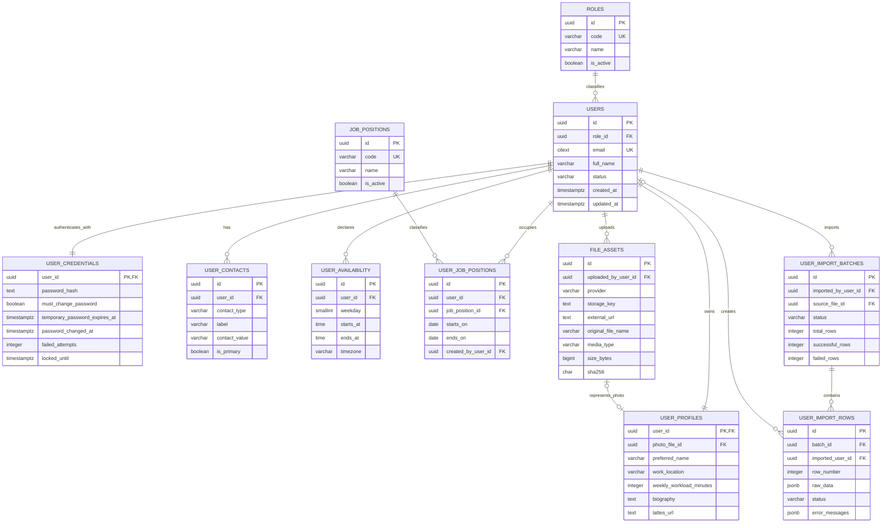
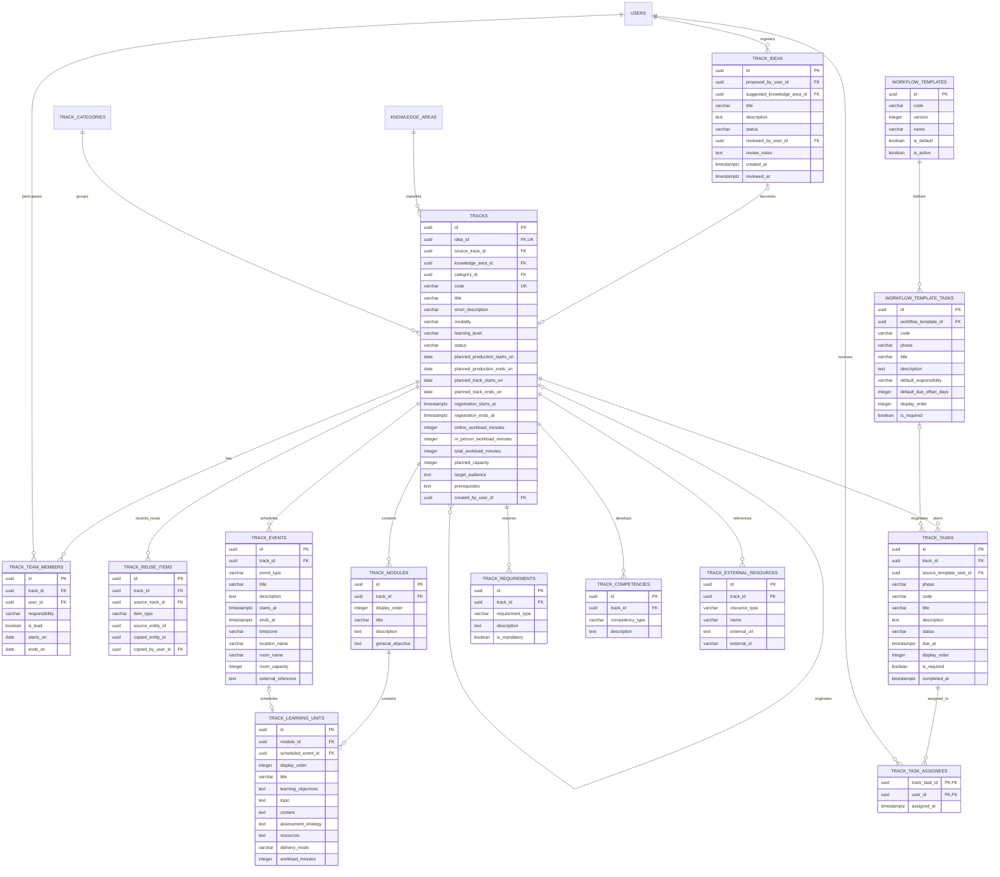
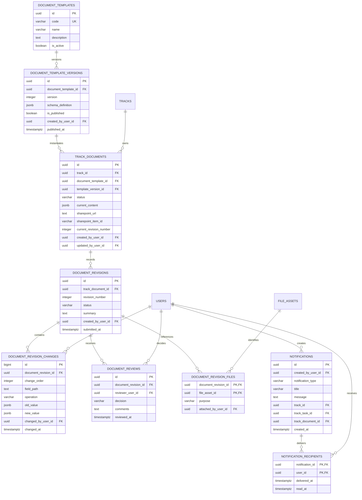

# Relatório de Modelagem do Banco de Dados Inicial

## 1. Objetivo

Este relatório descreve a modelagem implementada para o primeiro incremento do Sistema TIC. O escopo acompanha as semanas S1 a S5 do cronograma: autenticação, perfil de colaboradores, gestão de Trilhas, calendário, Proposta/Escopo, Plano de Ensino e notificações.

O banco usa PostgreSQL sem ORM, com migrations SQL incrementais. Tabelas e colunas usam nomes em inglês no padrão `snake_case`. Identificadores de negócio usam `uuid`, datas com horário usam `timestamptz` e alterações relevantes são auditadas.

Esta modelagem substituiu os scripts exploratórios de `docker/postgres/init`, que usavam `SERIAL`, possuíam apenas o papel administrativo e inseriam um usuário fictício.

O incremento foi implementado em quatro migrations e dois seeds. O executor calcula SHA-256, registra cada versão e impede que um arquivo já aplicado seja alterado silenciosamente. A validação automatizada foi executada em PostgreSQL 16 vazio e também confirmou que uma segunda execução não reaplica migrations nem seeds.

## 2. Principais mudanças em relação ao diagrama original

| Tema | Modelo original | Modelo implementado | Motivo |
| --- | --- | --- | --- |
| Trilha e oferta | `TRILHA` reutilizável gerando `OFERTA_TRILHA` | Cada registro de `tracks` representa uma realização única; uma reabertura referencia a anterior por `source_track_id` | Cada realização tem ciclo, equipe, calendário e histórico próprios |
| Ideias | A criação começava diretamente na Trilha | `track_ideas` mantém um backlog antes da conversão em Trilha | Preserva ideias avaliadas ou rejeitadas sem criar Trilhas falsas |
| Papéis | Relação muitos-para-muitos `USUARIO_PAPEL` | Cada usuário possui exatamente um papel global em `users.role_id` | Decisão funcional: Coordenador, Administrativo, Mentor ou Monitor |
| Cargo | Não existia separação entre papel e cargo | `job_positions` e `user_job_positions` | Papel controla acesso; cargo representa a posição institucional e mantém histórico |
| Senhas | Senha armazenada junto ao usuário | Credenciais isoladas em `user_credentials`, com senha provisória e troca obrigatória | Reduz exposição e deixa as regras de autenticação explícitas |
| Importação | Não modelada | `user_import_batches` e `user_import_rows` | Permite cadastro de colaboradores por planilha com erros por linha |
| Workflow | Estado concentrado na oferta | Modelo padrão clonável em tarefas independentes por fase | Trilhas trabalham em paralelo e não precisam de bloqueios rígidos entre fases |
| Modalidade | Texto livre | Apenas `online` e `hybrid`, com validações | Online é assíncrona; híbrida combina conteúdo online e encontros presenciais |
| Salas | Um campo de local na oferta | Sala e capacidade são fotografadas em `track_events` | A reserva ocorre no sistema da faculdade; o Sistema TIC registra apenas o resultado |
| Documentos | Versões completas em JSONB | Conteúdo atual mais revisões contendo somente diferenças por campo | Evita cópias repetidas e mantém autoria de cada alteração |
| Modelos documentais | Estrutura fixa implícita | `document_template_versions` guarda a estrutura de cada versão | Mudanças de formulário só afetam novas Trilhas |
| Arquivos | Arquivos genéricos sem política de armazenamento | `file_assets` guarda somente metadados e chave externa | Fotos, documentos, vídeos e evidências não ficam como binário no PostgreSQL |
| Softex | Relatórios, respostas e Anexo 12 no primeiro diagrama | Detalhamento adiado para migrations futuras | Os modelos ainda estão sendo definidos fora do sistema |
| Alunos | Inscrições, AVA, atividades, presença e certificado | Fora do primeiro incremento | A lista de alunos continuará externa até o módulo de inscrições |

### 2.1. Destino de cada tabela do diagrama original

O diagrama anterior não será descartado. Ele será dividido entre o banco inicial e migrations futuras, conforme o mapa abaixo.

| Tabela original | Destino após o planejamento | Implementação |
| --- | --- | --- |
| `USUARIO` | Dividida | `users` mantém identidade e papel; `user_credentials` mantém a senha; `user_profiles`, `user_contacts`, `user_availability` e `user_job_positions` completam o perfil |
| `PAPEL` | Mantida e renomeada | `roles`, inicialmente com Coordenador, Administrativo, Mentor e Monitor |
| `USUARIO_PAPEL` | Removida | `users.role_id` garante um único papel vigente; mudanças ficam em `audit_events` |
| `TRILHA` | Mantida e ampliada | `tracks` passa a representar uma realização única e recebe modalidade, período, cargas horárias, situação, categoria e planejamento de vagas |
| `MODULO_TRILHA` | Mantida e renomeada | `track_modules` |
| `ENCONTRO_MODULO` | Dividida | `track_learning_units` mantém conteúdo pedagógico; `track_events` mantém datas, horários e sala dos encontros híbridos |
| `OFERTA_TRILHA` | Incorporada em `tracks` | Não haverá uma oferta separada: uma reoferta é uma nova Trilha ligada à anterior por `source_track_id` |
| `OFERTA_RESPONSAVEL` | Mantida e renomeada | `track_team_members`, com vários responsáveis e indicação de líder |
| `TIPO_DOCUMENTO` | Ampliada | `document_templates` e `document_template_versions` permitem alterar a estrutura dos formulários sem afetar documentos antigos |
| `DOCUMENTO_OFERTA` | Mantida e renomeada | `track_documents` |
| `VERSAO_DOCUMENTO` | Redesenhada | `document_revisions` agrupa revisões e `document_revision_changes` guarda apenas diferenças por campo |
| `APROVACAO_DOCUMENTO` | Mantida e renomeada | `document_reviews`, com decisões de aprovação, rejeição ou solicitação de ajustes |
| `ARQUIVO` | Mantida e renomeada | `file_assets`, somente com metadados, hash e localização externa; nenhum binário será salvo no PostgreSQL |
| `ARQUIVO_VINCULO` | Removida como relação polimórfica | Vínculos explícitos, como `document_revision_files` e `user_profiles.photo_file_id`, preservam integridade referencial |
| `ALUNO` | Adiada | Migration futura do módulo de estudantes |
| `INSCRICAO` | Adiada | Migration futura do módulo de seleção e inscrições |
| `TIPO_PENDENCIA` | Adiada | Será redesenhada com o fluxo real de análise de candidatos |
| `PENDENCIA_INSCRICAO` | Adiada | Migration futura de inscrições |
| `MATRICULA_AVA` | Adiada | Futuro registro da inclusão no Teams; a integração automática não faz parte do V1 |
| `ATIVIDADE_OFERTA` | Adiada | Futuro módulo acadêmico, ligado à Trilha e às unidades de aprendizagem |
| `ENTREGA_ATIVIDADE` | Adiada | Futuro módulo acadêmico por inscrição do aluno |
| `RESULTADO_FINAL_ALUNO` | Adiada | Futuro módulo de fechamento e certificação |
| `MODELO_RELATORIO` | Adiada | Será substituída por modelos versionados da Softex quando os documentos forem estabilizados |
| `ITEM_MODELO_RELATORIO` | Adiada | Futura definição versionada dos itens Softex |
| `RELATORIO_OFERTA` | Adiada | Futuro relatório por Trilha |
| `RESPOSTA_ITEM_RELATORIO` | Adiada | Futuras respostas aos itens do modelo Softex |
| `CERTIFICADO` | Adiada | Futuro módulo de conclusão e certificados |
| `COMUNICACAO` | Dividida | Avisos internos entram agora em `notifications`; e-mails, WhatsApp e comunicações com alunos serão modelados depois |
| `HISTORICO_EVENTO` | Mantida e generalizada | `audit_events`, com diferenças estruturadas em JSONB, ator, entidade e correlação |

O relacionamento direto entre `TIPO_PENDENCIA` e `ALUNO` exibido ao final do diagrama original será removido. Uma pendência pertence a uma inscrição específica, nunca diretamente ao aluno nem em uma relação muitos-para-muitos com tipos de pendência.

## 3. Convenções gerais

- Chaves primárias: `uuid` com `gen_random_uuid()`.
- E-mails: `citext` e restrição `unique`, evitando duplicidade por diferença entre maiúsculas e minúsculas.
- Datas de auditoria: `created_at`, `updated_at` e `timestamptz`.
- Exclusão: registros históricos não serão apagados fisicamente; usuários e catálogos serão desativados.
- Estados controlados: restrições `check` ou catálogos, evitando textos arbitrários.
- Valores de carga horária: minutos inteiros; o total será calculado a partir das parcelas presencial e online.
- Conteúdo documental variável: `jsonb`, vinculado a uma versão imutável de modelo.
- Arquivos: somente metadados, URL/chave externa, MIME type, tamanho e hash.
- Auditoria: diferenças em JSONB, ator, entidade, ação, data e correlação da operação.

## 4. Migration 001 — Fundação e catálogos

### Tabelas

| Tabela | Finalidade | Campos principais |
| --- | --- | --- |
| `schema_migrations` | Controlar scripts já aplicados | `version`, `name`, `checksum_sha256`, `applied_at` |
| `data_seeds` | Controlar seeds já aplicados | `version`, `name`, `checksum_sha256`, `applied_at` |
| `roles` | Papéis globais do sistema | `id`, `code`, `name`, `description`, `is_active` |
| `job_positions` | Catálogo de cargos institucionais | `id`, `code`, `name`, `description`, `is_active` |
| `knowledge_areas` | Catálogo administrável de áreas de conhecimento | `id`, `code`, `name`, `description`, `is_active` |
| `track_categories` | Grupos usados nos filtros de Trilhas | `id`, `code`, `name`, `description`, `is_active` |
| `audit_events` | Histórico transversal de alterações | `id`, `actor_user_id`, `entity_type`, `entity_id`, `action`, `changes`, `correlation_id`, `occurred_at` |

Os papéis iniciais são `coordinator`, `administrator`, `mentor` e `monitor`. O Coordenador é o único papel autorizado a criar usuários e alterar papéis quando `app.current_user_id` identifica o ator da operação; a migration já aplica essa proteção no banco, e o backend deverá reforçá-la posteriormente.

## 5. Migration 002 — Usuários e colaboradores

### Regras importantes

- Um usuário possui um único `role_id` ativo.
- O e-mail de acesso é obrigatório e único sem diferenciar maiúsculas e minúsculas.
- A senha provisória nunca será armazenada em texto puro; somente seu hash será persistido.
- `must_change_password = true` limita o primeiro acesso à troca de senha.
- Apenas um cargo pode ter `ends_on is null` para o mesmo usuário.
- Blocos de disponibilidade do mesmo usuário não podem ter horários inválidos; sobreposições serão rejeitadas.
- A planilha de importação é processada linha a linha e os erros não impedem o registro das linhas válidas.

## 6. Migration 003 — Ideias, Trilhas, workflow, calendário e currículo

### Estados e fases

- Ideia: `new`, `under_review`, `accepted`, `rejected`, `archived`.
- Trilha: `draft`, `planning`, `production`, `pre_track`, `running`, `post_track`, `completed`, `cancelled`.
- Fase de tarefa: `planning`, `production`, `pre_track`, `track`, `post_track`.
- Tarefa: `todo`, `in_progress`, `blocked`, `done`, `cancelled`.

O estado geral da Trilha serve para filtro e comunicação. Ele não bloqueia automaticamente tarefas de outras fases, pois o trabalho pode ocorrer em paralelo.

### Regras de modalidade

- `online`: carga presencial igual a zero; unidades de aprendizagem somente `online_async`; não existem aulas síncronas para alunos.
- `hybrid`: deve possuir carga online e presencial; unidades podem ser `online_async` ou `in_person`.
- Um evento `hybrid_class` só pode pertencer a uma Trilha híbrida e exige `room_name` e `room_capacity`.
- Não haverá validação de conflito de sala, porque a reserva ocorre no sistema da faculdade.
- A capacidade registrada é apenas uma referência de planejamento. Alunos e lista final não fazem parte deste incremento.

### Reabertura de Trilha

Uma reabertura cria uma nova linha em `tracks` e preenche `source_track_id`. As cópias seletivas de workflow, currículo, documentos, requisitos e competências ficam registradas em `track_reuse_items`. Equipe, calendário, tarefas concluídas, evidências e participantes nunca são compartilhados entre as duas Trilhas.

## 7. Migration 004 — Documentos e notificações

### Modelos iniciais

Foram cadastrados dois modelos:

1. `proposal_scope`: baseado no documento Proposta e Escopo, com os dados operacionais relevantes também normalizados em `tracks`, `track_requirements` e `track_competencies`.
2. `teaching_plan`: baseado no Plano de Ensino, com módulos e unidades normalizados em `track_modules` e `track_learning_units`.

Campos variáveis ou que não precisam de filtro permanecem em `TRACK_DOCUMENTS.current_content`. Isso permite alterar a estrutura dos formulários sem criar uma coluna SQL para cada nova pergunta.

### Versionamento por diferenças

- O documento possui somente um conteúdo completo atual em `current_content`.
- Uma revisão agrupa as alterações realizadas antes de cada submissão.
- Cada diferença registra caminho do campo, operação, valor anterior, valor novo, autor e horário.
- Revisões submetidas são imutáveis.
- A reconstrução histórica começa em um objeto vazio e reaplica as alterações na ordem das revisões.
- Uma nova versão de modelo é usada apenas por documentos criados depois de sua publicação.
- Arquivos e evidências não são copiados; cada revisão referencia a versão externa por `file_assets`.
- Decisões administrativas possíveis: `approved`, `changes_requested` e `rejected`.

### Notificações

Notificações automáticas já são geradas para atribuição de tarefa, submissão e validação de documento. O tipo `task_due` deixa o esquema preparado para o futuro processo agendado de proximidade de prazo. Avisos manuais usam o mesmo modelo, e a leitura é individual em `notification_recipients.read_at`.

## 8. Dados fora do primeiro incremento

As seguintes estruturas do diagrama original não serão criadas agora:

- alunos e dados pessoais de estudantes;
- candidaturas, inscrições, pendências e confirmação de lista;
- matrícula no Teams/AVA;
- presença, avaliações, atividades e notas;
- resultado final e certificado;
- relatórios de prestação de contas, respostas Softex e Anexo 12;
- assinatura digital;
- envio automático de e-mails, integração com Teams ou SharePoint;
- catálogo ou motor de reserva de salas.

Esses módulos serão adicionados por migrations futuras, usando `tracks`, `track_events`, `file_assets` e `track_external_resources` como pontos de integração.

## 9. Ordem de implementação e validação

1. As quatro migrations são aplicadas na ordem numérica pelo script `database/scripts/apply-migrations.ps1`.
2. Os seeds cadastram papéis, cargos, áreas, categoria, 26 tarefas do workflow padrão e as versões iniciais dos dois modelos documentais.
3. O `psql` do container oficial aplica cada arquivo em uma transação e registra seu SHA-256.
4. O script `database/scripts/test-database.ps1` sobe uma instância isolada, executa os testes de regras e repete o executor para validar idempotência.
5. Os scripts exploratórios e o usuário fictício foram removidos de `docker/postgres/init`.

## 10. Decisões ainda deliberadamente adiadas

- Estrutura definitiva dos relatórios Softex.
- Campos pessoais, critérios e retenção de dados dos alunos.
- Forma de importar planilhas de presença e atividades do Teams.
- Provedor de armazenamento de produção; o banco já ficará independente dessa escolha.
- Regras finais de conclusão, presença e certificação.
